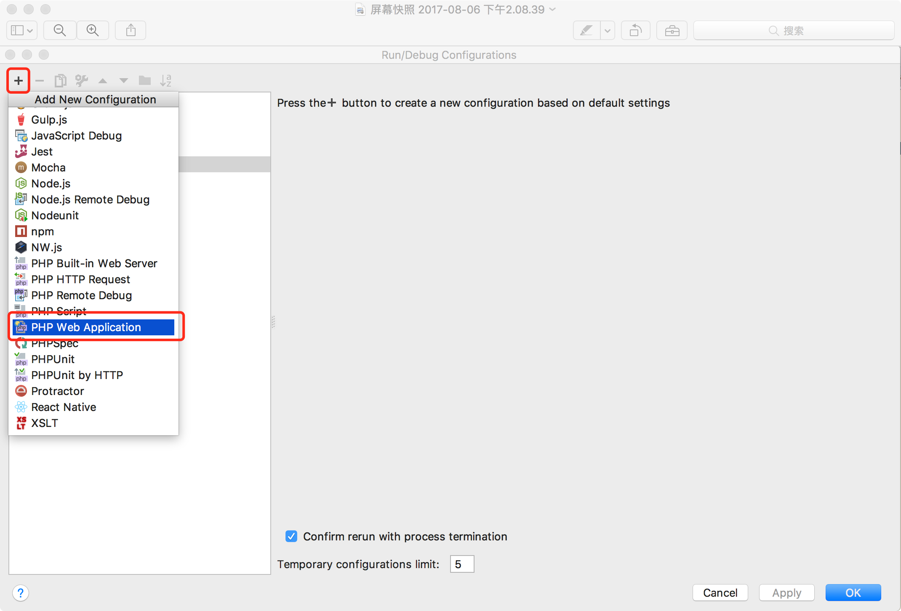
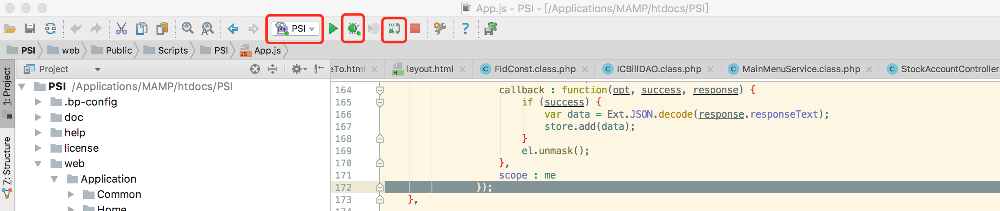

## MAMP 修改 php.ini 文件
位置 File -> Edit Template -> PHP(php.ini)
选择 PHP 版本
在 xdebug 项加入

```
 xdebug.remote_enable=1
 xdebug.remote_host=localhost
 xdebug.remote_port=9000
 xdebug.remote_autostart=1
 xdebug.idekey="PHPSTORM"
```
MAMP 中 xdebug 选项要打开


## PHPStrom 配置
### 配置 Servers
位置 PhpStorm -> Preferences -> Languges & Frameworks -> PHP -> Servers

### 配置 Edit Configurations


选择 1 中添加的 Servers

## 浏览器配置
安装 [Xdebug](https://chrome.google.com/webstore/detail/xdebug-helper/eadndfjplgieldjbigjakmdgkmoaaaoc) 插件。
安装完成之后在 Chrome 插件的地方右击选择 **选项** 


## 开始调试

这几个地方点击选择完成就可以打断点调试了。


